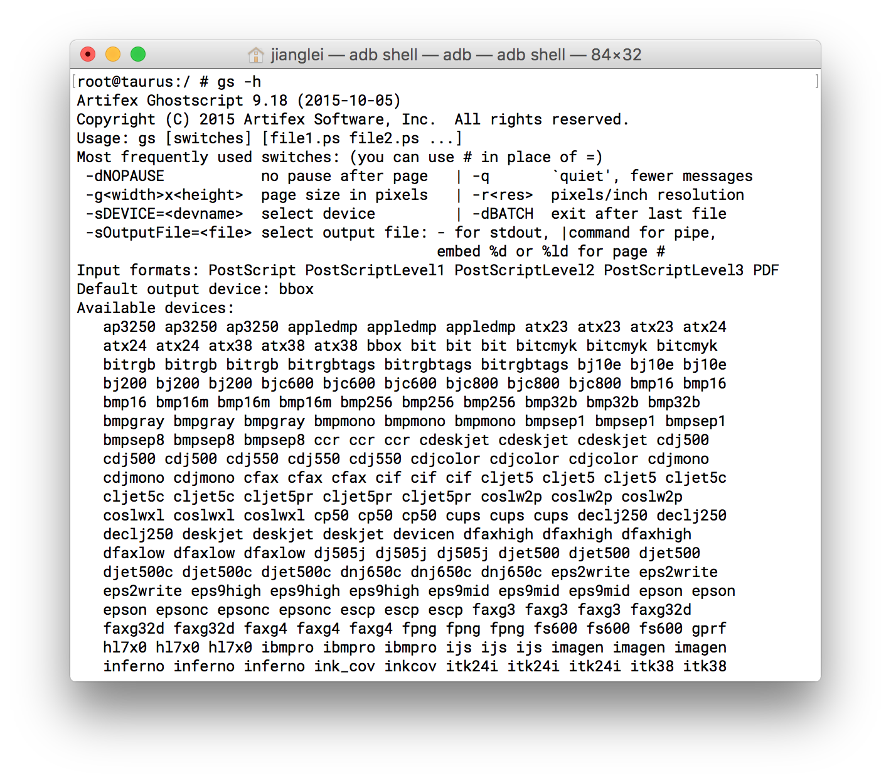

#GhostScript

####1.简介

Ghostscript是一套建基于Adobe、PostScript及可移植文档格式（PDF）的页面描述语言等而编译成的免费软件，[主页](http://www.ghostscript.com)。

####2.废话

我不喜欢Ghostscript目前所采用的把所有以来的库与生成的可执行文件放在一起的做法，毕竟依赖的库是可以单独拿出来重复利用的。因此我移除了Ghostscript自带的几个库，单独的做成动态库以便重复利用，Ghostscript可能需要到的几个库可以在我的仓库里找到。多说一句，我用的是当前的最新版的Ghostscript 9.19。再多说一句，因为gs运行时需要/tmp文件夹，但是android没有，因此我使用自己建立的文件夹，具体可在base/gp_unifs.c搜索tmp找到 

```c
 strcpy(fname, "/system/usr/root/var/gs/tmp/");
```

然后把`/system/usr/root/var/gs/tmp/`改成你可以使用的tmp文件夹。

|       库        |                    简介                    |                    地址                    |
| :------------: | :--------------------------------------: | :--------------------------------------: |
|    libtiff     |    提供了标签图像文件格式（TIFF）的支持，被广泛用于存储图像数据格式    | [仓库地址](https://github.com/jianglei12138/libtiff) |
|     libijs     |            IJS是一个栅格页面图像传输协议。             | [仓库地址](https://github.com/jianglei12138/ijs) |
|     lcms2      |          开源的小型彩色管理引擎，特别注重精度和性能。          | [仓库地址](https://github.com/jianglei12138/libcms2) |
|    libjpeg     | libjpeg是一个完全用C语言编写的库,包含了被广泛使用的JPEG解码、JPEG编码和其他的JPEG功能的实现 | [仓库地址](https://github.com/jianglei12138/jpeg) |
|   fontconfig   | fontconfig 是提供系统范围内字体设置,定制和允许应用程序访问的函数库  | [仓库地址](https://github.com/jianglei12138/fontconfig) |
|    libpng12    |              libpng是官方PNG库               | [仓库地址](https://github.com/jianglei12138/libpng12) |
| cups/cupsimage |         cups依赖的库，如果你不使用cups可以不用          | [仓库地址](https://github.com/jianglei12138/cups) |
|    freetype    | FreeType库是一个完全免费（开源）的、高质量的且可移植的字体引擎，它提供统一的接口来访问多种字体格式文件 | [仓库地址](https://github.com/jianglei12138/freetype) |

####3.configure

- 我使用的是NDK导出的交叉编译工具链

- configure

  ```shell
  ./configure --host=arm-linux-androideabi --disable-sse2 --disable-dbus --disable-gtk --with-system-libtiff --without-luratech --prefix=/system/usr/root (如果不需要cups可以使用加上--disable-cups)
  ```
- 为了方便编译，我添加部分编译过程需要的几个可执行文件放到了obj/aux(在ubuntu x64下编译，如果是其他的操作系统，需要自己编译PC版的，然后把相应的可执行文件拷贝到相应的文件夹)，因此编译的时候不要make clean
- make
- make install DESTDIR=/where/you/like
- 更多的configure选项可以用configure -h查看
- 编译后的gs体积很大，可以再使用arm-linux-androideabi-strip瘦身

####4.测试

